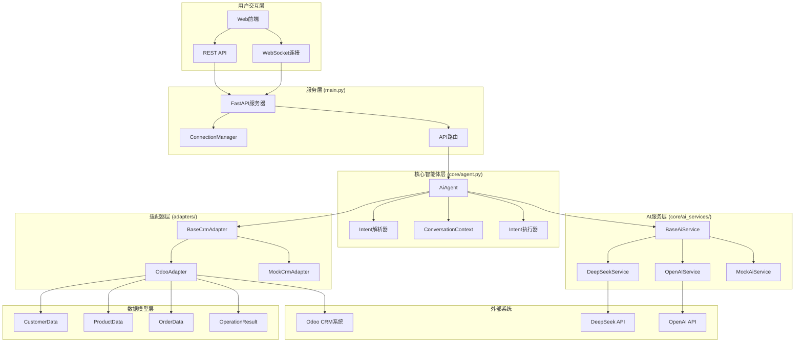
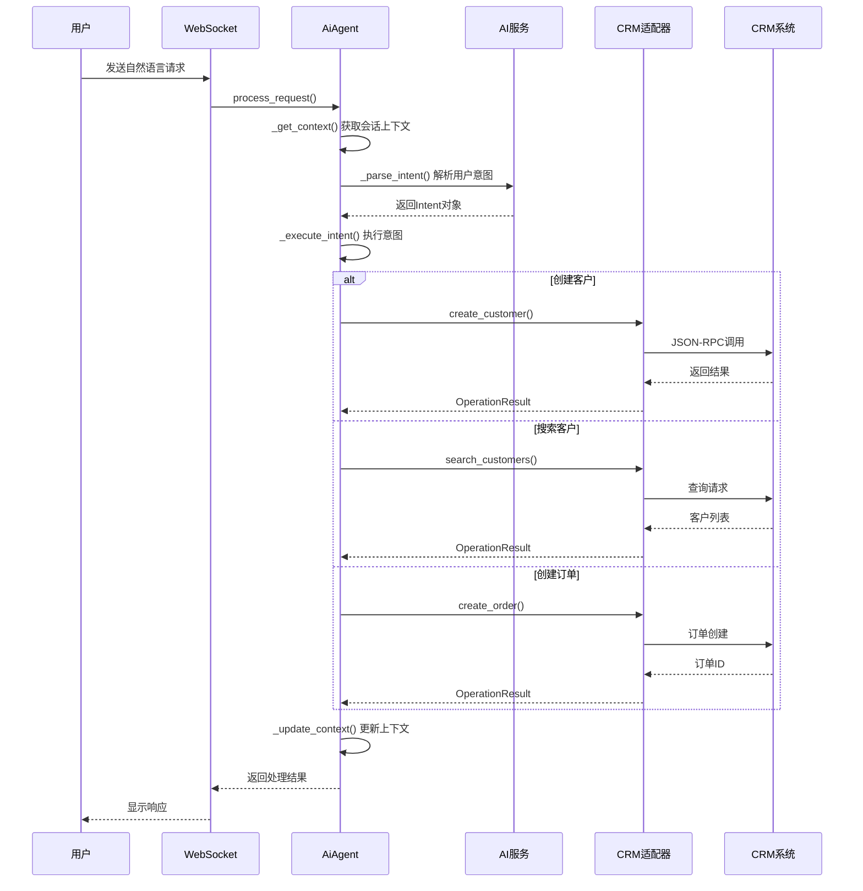
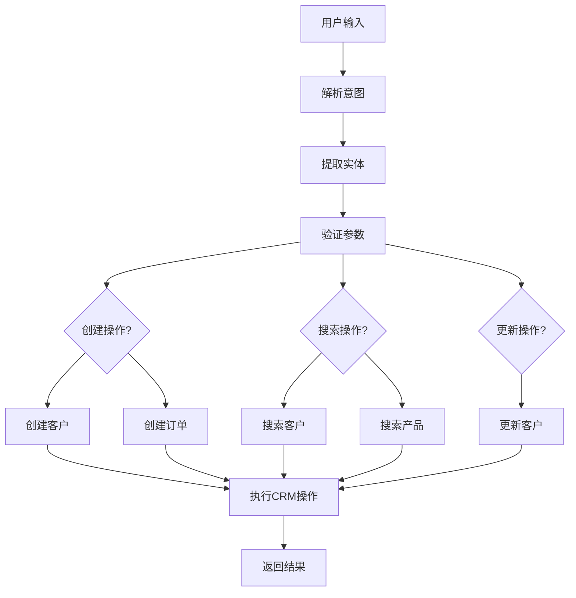
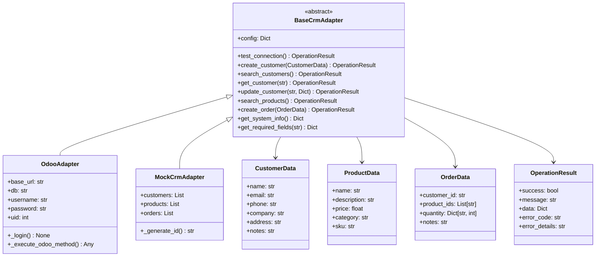
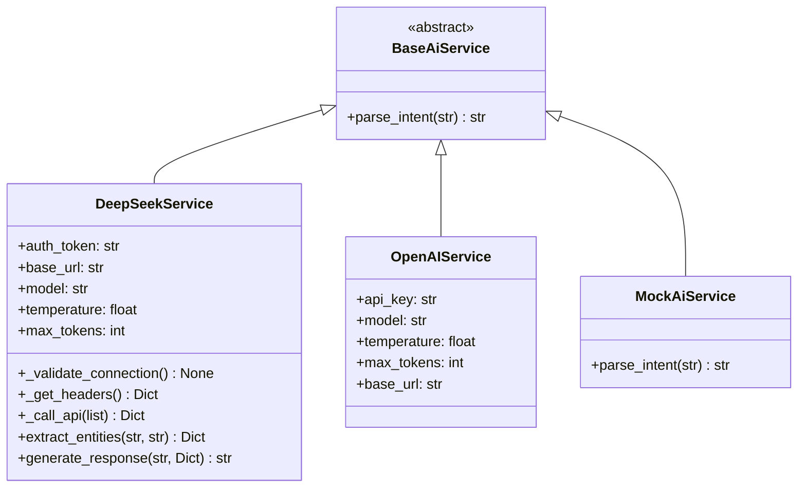
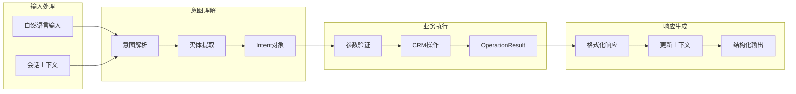

# AI CRM助手智能体架构分析

## 系统概览

本系统是一个基于FastAPI的AI CRM助手，采用模块化设计，支持多种AI服务提供商和CRM系统适配器。

## 核心组件架构

## 智能体处理流程

## Intent解析流程

## 适配器模式架构

## AI服务架构

## 核心数据流

## 关键特性

### 1. 模块化设计
- **适配器模式**: 支持多种CRM系统（Odoo、Mock等）
- **策略模式**: 支持多种AI服务提供商（DeepSeek、OpenAI等）
- **标准化接口**: 统一的数据模型和操作接口

### 2. 异步处理
- 基于FastAPI的异步Web服务
- WebSocket实时通信
- 异步AI服务调用

### 3. 会话管理
- 多轮对话上下文保持
- 会话状态管理
- 历史记录维护

### 4. 错误处理
- 分层异常处理
- 标准化错误响应
- 连接状态监控

### 5. 扩展性
- 插件化适配器架构
- 可配置AI服务
- 标准化数据接口

## 配置管理

系统支持多种配置方式：
- AI服务配置（API密钥、模型参数等）
- CRM适配器配置（连接信息、认证等）
- 服务器配置（端口、CORS等）

## 部署架构

系统支持多种部署方式：
- 单机部署
- Docker容器化
- Kubernetes集群部署