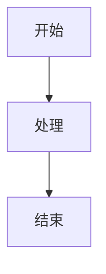
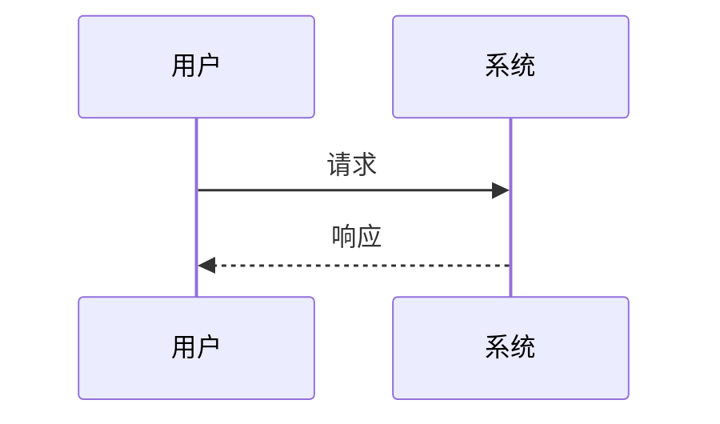
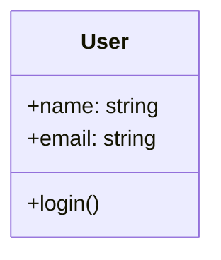

# Mermaid 渲染测试

## 基础流程图

```mermaid
graph TD
    A[开始] --> B[处理]
    B --> C[结束]
```

## 时序图

```mermaid
sequenceDiagram
    participant A as 用户
    participant B as 系统
    A->>B: 请求
    B-->>A: 响应
```

## 类图

```mermaid
classDiagram
    class User {
        +name: string
        +email: string
        +login()
    }
```